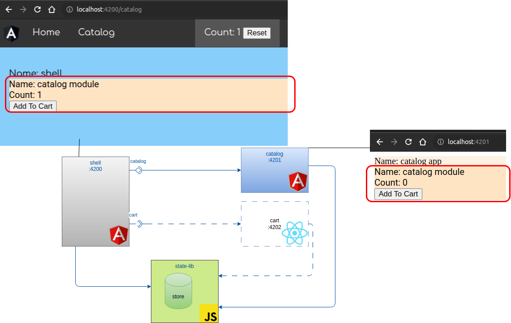

# module federation showcase

This repository contains several showcases about the micro frontend architechtures with module federation.

## Application architecture

- A **shell** (Angular) application,contains a module of a **catalog** (Angular) application.
- The `/catalog` route within the **shell** application points to the root (`/`) route of the **catalog** module.
 
